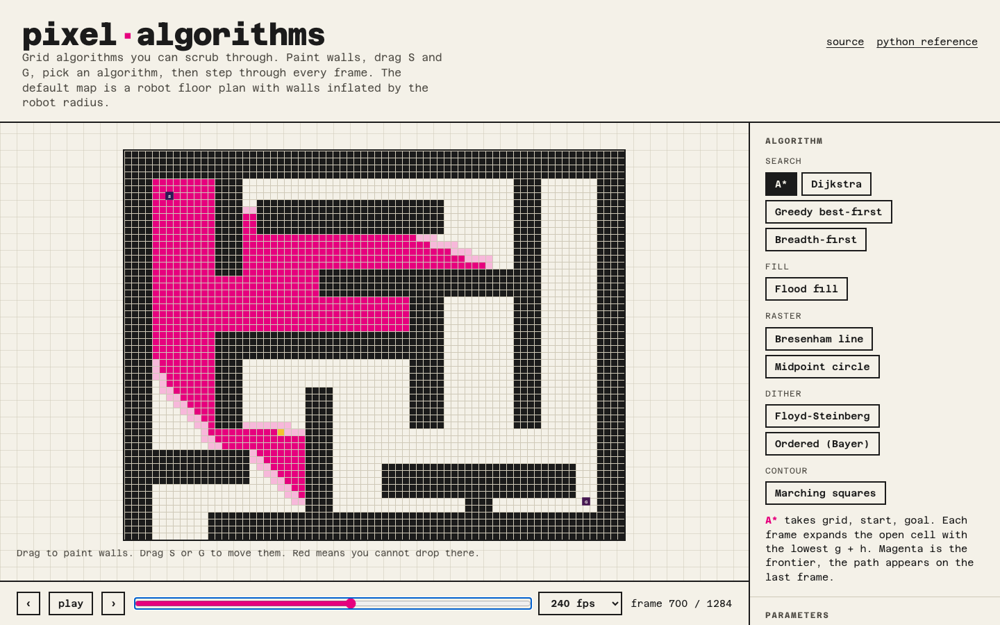

# pixel-algorithms 🧩

**[pixels.lucasmsa.com](https://pixels.lucasmsa.com)**

> Grid algorithms you can scrub through, frame by frame. Paint walls, drag start and goal, pick an algorithm, then step through every expansion, fill, pixel or contour segment. The default map is a robot floor plan: walls are inflated by the robot radius before the search runs.

This is the web home of [a-star-visualizer](https://github.com/lucasmsa/a-star-visualizer), the 2021 Python project. That repo stays as the reference implementation and produces the golden fixtures this port is tested against.



## What is on the shelf 🕸

| Algorithm | Input | What the frames show |
|---|---|---|
| A* | grid, start, goal | One expansion per frame, lowest g + h first. Magenta frontier, green path on the last frame |
| Dijkstra | grid, start, goal | A* with the heuristic off; the frontier grows as a circle |
| Greedy best-first | grid, start, goal | Expands whatever looks closest to the goal; fast, not optimal |
| Breadth-first | grid, start, goal | Rings of equal step count |
| Flood fill | grid, seed | One painted cell per frame; 4- or 8-connected |
| Bresenham line | start, goal | One pixel per frame, integer arithmetic only |
| Midpoint circle | centre, radius | One octant step per frame, mirrored eight ways |
| Floyd-Steinberg | imported image | One row per frame; each pixel pushes its rounding error to its neighbours |
| Ordered (Bayer) | imported image | One row per frame against a tiled 4×4 or 8×8 threshold matrix |
| Marching squares | grid | One row of 2×2 windows per frame; mixed windows emit a contour segment |

Searches share one rule set: orthogonal steps cost 1, diagonals cost √2 and never cut a wall corner; ties break on f, then h, then insertion order, so the expansion order is deterministic. Heuristics: octile, manhattan, euclidean, chebyshev. A weight slider goes from 0 (Dijkstra) through 1 (A*) to 3.

## Floor plans 🤖

1. Import any image. Dark pixels (luma below 5/255) are walls.
2. Walls grow by the robot radius, in source pixels, with a square kernel. The robot is then a point.
3. The plan is split into `floor(size / 50)` blocks per axis, each block becomes N×N cells (N is the resolution slider). A cell is a wall if any source pixel inside it is.

With the defaults (radius 7, 8 cells per block) the shipped `mapa_robotica.png` (450×360) becomes the same 72×56 grid with 1,912 walls that the Python reference builds. A* from (6, 6) to (66, 50) finds a 94-cell path of cost 103.36 after expanding 1,284 cells, in both.

The dither algorithms run on the imported grayscale, and "use as map" turns the ink into walls so you can search across a dithered photo.

## Running it 🔧

```sh
pnpm install
pnpm dev          # http://localhost:5173
pnpm test         # 34 unit tests (vitest)
pnpm test:e2e     # 4 Playwright flows against a production build
pnpm typecheck
```

## How it is built 🎢

- `src/core`: pure TypeScript. `Grid` is a `Uint8Array`; every algorithm is a generator of delta frames (`current`, `opened`, `closed`, `painted`, `segments`, `path`, `cost`). No DOM imports, so Vitest runs them in Node.
- `src/utils/replay.ts` rebuilds the picture at any playhead from the frames, so scrubbing never re-runs the algorithm.
- `src/hooks`: a Zustand store for inputs and playback, a canvas renderer, pointer handling for painting and dragging markers, image import. Components only render.
- `src/core/__fixtures__`: the three golden fixtures from the Python reference (`open_room`, `corridors`, `mapa_robotica`) plus the raw 450×360 wall mask. Tests assert path, expansion order and cost match, and that the image pipeline reproduces the 72×56 grid.
- Decisions are in [`docs/adr`](./docs/adr).

## Deploying 🚀

Live at [pixels.lucasmsa.com](https://pixels.lucasmsa.com). Vite static build on Vercel, `vercel.json` included.

```sh
pnpm build   # dist/
```
